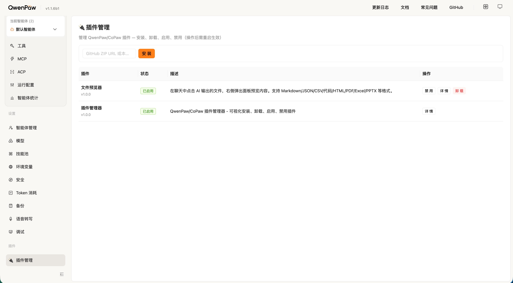

# QwenPaw File Viewer

[](LICENSE)
[](https://github.com/longgb246/qwenpaw-file-viewer/actions/workflows/ci.yml)
[](https://github.com/longgb246/qwenpaw-file-viewer)
[](https://github.com/agentscope-ai/QwenPaw)

A file preview plugin for [QwenPaw](https://github.com/agentscope-ai/QwenPaw) (formerly CoPaw).

> **⚠️ Disclaimer**: This is an **unofficial**, community-maintained plugin. It is **not** affiliated with, endorsed by, or officially supported by the QwenPaw / agentscope-ai team. Use at your own discretion.

Click on AI-generated files in the chat to preview them in a slide-out panel — Markdown, JSON, CSV, code, HTML, PDF, Excel, and PPTX.

## Features

- **Inline Preview** — Click file cards in chat to open a side panel
- **Markdown Rendering** — Full support for headings, tables, code blocks, links
- **JSON Pretty-Print** — Auto-formatted JSON viewer
- **CSV Tables** — Auto-converted to HTML tables
- **Code Highlighting** — Syntax display for Python, JS, SQL, and more
- **HTML Sandbox** — Iframe-based HTML preview
- **PDF Viewer** — Inline PDF rendering via data URL
- **Excel Viewer** — Powered by [Luckysheet](https://github.com/mengshukeji/Luckysheet)
- **PPTX Viewer** — Slide-by-slide PowerPoint preview
- **Agent Awareness** — Auto-injects capabilities into PROFILE.md
- **Auto Config Detection** — Supports both `.copaw` (legacy) and `.qwenpaw` (new) directories

## Screenshots



## Supported Formats

| Category | Extensions |
|----------|-----------|
| Text | `.md` `.json` `.txt` `.log` `.csv` `.xml` `.yaml` `.yml` `.toml` `.ini` `.cfg` |
| Code | `.py` `.js` `.ts` `.tsx` `.jsx` `.css` `.sql` `.java` `.go` `.rs` `.c` `.cpp` `.sh` |
| Web | `.html` `.htm` |
| Documents | `.pdf` `.xlsx` `.xls` `.pptx` `.ppt` |
| Images | `.png` `.jpg` `.jpeg` `.gif` `.webp` `.svg` |

> Max file size: **5MB**

## Requirements

- [QwenPaw](https://github.com/agentscope-ai/QwenPaw) >= 1.1.0 (with dynamic plugin support)
- Python 3.10+

## Installation

### Quick Install (Recommended)

```bash
git clone https://github.com/longgb246/qwenpaw-file-viewer.git
cd qwenpaw-file-viewer
bash install.sh
```

### Using QwenPaw CLI

```bash
qwenpaw plugin install /path/to/qwenpaw-file-viewer
```

### Manual Install

```bash
# Detect your config directory
CONFIG_DIR="$HOME/.copaw"
[ ! -d "$CONFIG_DIR" ] && CONFIG_DIR="$HOME/.qwenpaw"

# Copy plugin files
mkdir -p "$CONFIG_DIR/plugins/file-viewer"
cp plugin.json src/plugin.py src/frontend.js src/__init__.py src/start.py "$CONFIG_DIR/plugins/file-viewer/"
cp -r src/static "$CONFIG_DIR/plugins/file-viewer/static"

# Restart QwenPaw
qwenpaw shutdown && qwenpaw app
```

## Uninstall

```bash
bash uninstall.sh
```

Or via QwenPaw CLI:

```bash
qwenpaw plugin uninstall file-viewer
```

## Usage

After installation and restarting QwenPaw:

1. In chat, ask the AI to use `write_file` to create a file (e.g., a Markdown report)
2. A clickable file card appears in the chat
3. Click the card to open the preview panel on the right
4. Use **Download** to save or **Close** to dismiss

### Architecture

```
Browser (QwenPaw Console)          Backend (port 39150)
┌──────────────────────┐          ┌─────────────────┐
│  frontend.js         │  POST    │  plugin.py       │
│  ├─ FileCard         │ ──────→  │  ├─ /read        │
│  ├─ PreviewPanel     │  JSON    │  ├─ /static/*    │
│  ├─ XlsxRenderer     │ ←──────  │  └─ FileViewer   │
│  └─ PptxRenderer     │          │      Handler     │
└──────────────────────┘          └─────────────────┘
```

### API Endpoints

| Method | Path | Description |
|--------|------|-------------|
| POST | `/read` | Read file content (`{"path": "/path/to/file"}`) |
| GET | `/static/*` | Serve static assets (Luckysheet CSS/JS) |

## Development

### Dev Mode (Symlink)

```bash
make dev
```

### Standalone Backend

Run the backend server without QwenPaw:

```bash
python3 src/start.py
```

### Project Structure

```
qwenpaw-file-viewer/
├── src/                         # Plugin core source files
│   ├── plugin.py                # Backend: HTTP API server (port 39150)
│   ├── frontend.js              # Frontend: React file card + preview panel
│   ├── __init__.py              # Python package init
│   ├── start.py                 # Standalone server launcher
│   └── static/                  # Frontend dependencies (~30MB)
│       ├── css/                 # Luckysheet styles
│       ├── fonts/               # FontAwesome
│       ├── plugins/             # Luckysheet plugins
│       ├── assets/              # Icon fonts
│       ├── demoData/            # Luckysheet demo data
│       ├── expendPlugins/       # Chart plugin
│       ├── luckysheet.umd.js   # Luckysheet library
│       ├── jquery.min.js        # jQuery
│       ├── xlsx.full.min.js     # SheetJS (Excel parsing)
│       └── pptx-viewer.js       # PPTX renderer
├── docs/                        # Documentation assets
├── .github/                     # GitHub integration
│   ├── workflows/ci.yml         # CI pipeline
│   ├── ISSUE_TEMPLATE/          # Issue templates
│   └── pull_request_template.md
├── plugin.json                  # Plugin manifest
├── install.sh                   # One-click install script
├── uninstall.sh                 # One-click uninstall script
├── Makefile                     # Dev shortcuts
├── LICENSE                      # MIT License
├── CHANGELOG.md                 # Version history
├── CONTRIBUTING.md              # Contributing guide
├── .editorconfig                # Editor settings
├── README.md                    # English documentation
└── README_zh.md                 # Chinese documentation
```

### Config Directory Detection

The plugin follows QwenPaw's config directory priority:

1. `QWENPAW_WORKING_DIR` environment variable (if set)
2. `~/.copaw` (if exists — legacy installation)
3. `~/.qwenpaw` (default for new installations)

## License

[MIT](LICENSE) © longgb246
