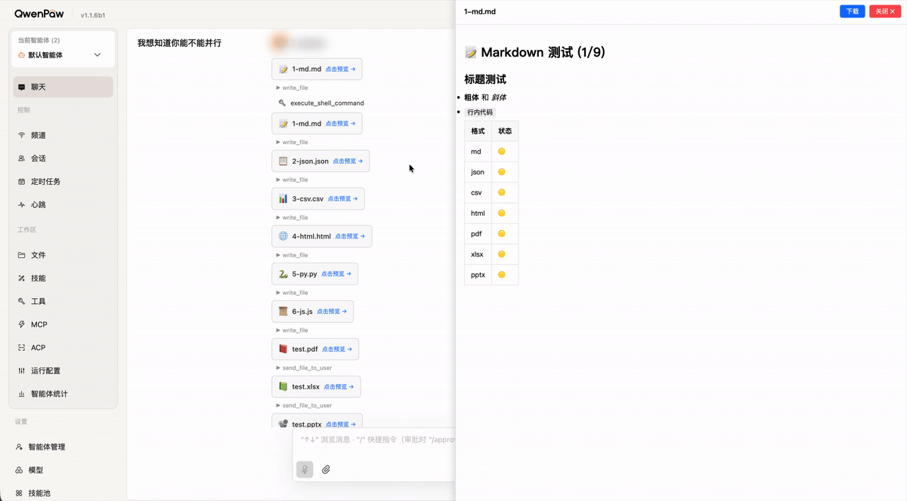

# QwenPaw 文件预览器

[](LICENSE)
[](https://github.com/longgb246/qwenpaw-file-viewer/actions/workflows/ci.yml)
[](https://github.com/longgb246/qwenpaw-file-viewer)
[](https://github.com/agentscope-ai/QwenPaw)

[QwenPaw](https://github.com/agentscope-ai/QwenPaw)（原 CoPaw）的文件预览插件。

> **⚠️ 声明**：本项目为**非官方**的社区维护插件，与 QwenPaw / agentscope-ai 官方团队**无关**，未获得官方认可或支持。请自行评估后使用。

在聊天中点击 AI 输出的文件，右侧弹出面板预览内容——支持 Markdown、JSON、CSV、代码、HTML、PDF、Excel 和 PPTX。

## 功能特性

- **内联预览** — 点击聊天中的文件卡片，右侧滑出预览面板
- **Markdown 渲染** — 完整支持标题、表格、代码块、链接
- **JSON 格式化** — 自动格式化 JSON 显示
- **CSV 表格** — 自动转换为 HTML 表格展示
- **代码高亮** — Python、JS、SQL 等语言的语法显示
- **HTML 沙箱** — 基于 iframe 的安全 HTML 预览
- **PDF 查看** — 内联 PDF 渲染
- **Excel 查看** — 基于 [Luckysheet](https://github.com/mengshukeji/Luckysheet) 的表格预览
- **PPTX 查看** — 逐页幻灯片预览
- **Agent 感知** — 自动向 PROFILE.md 注入能力说明
- **自动检测配置目录** — 同时兼容 `.copaw`（旧版）和 `.qwenpaw`（新版）

## 截图


## 演示



## 支持的格式

| 分类 | 扩展名 |
|------|--------|
| 文本 | `.md` `.json` `.txt` `.log` `.csv` `.xml` `.yaml` `.yml` `.toml` `.ini` `.cfg` |
| 代码 | `.py` `.js` `.ts` `.tsx` `.jsx` `.css` `.sql` `.java` `.go` `.rs` `.c` `.cpp` `.sh` |
| 网页 | `.html` `.htm` |
| 文档 | `.pdf` `.xlsx` `.xls` `.pptx` `.ppt` |
| 图片 | `.png` `.jpg` `.jpeg` `.gif` `.webp` `.svg` |

> 单文件大小限制：**5MB**

## 环境要求

- [QwenPaw](https://github.com/agentscope-ai/QwenPaw) >= 1.1.0（需支持动态插件系统）
- Python 3.10+

## 安装

### 一键安装（推荐）

```bash
git clone https://github.com/longgb246/qwenpaw-file-viewer.git
cd qwenpaw-file-viewer
bash install.sh
```

### 通过 QwenPaw CLI 安装

```bash
qwenpaw plugin install /path/to/qwenpaw-file-viewer
```

### 手动安装

```bash
# 检测配置目录
CONFIG_DIR="$HOME/.copaw"
[ ! -d "$CONFIG_DIR" ] && CONFIG_DIR="$HOME/.qwenpaw"

# 复制插件文件
mkdir -p "$CONFIG_DIR/plugins/file-viewer"
cp plugin.json src/plugin.py src/frontend.js src/__init__.py src/start.py "$CONFIG_DIR/plugins/file-viewer/"
cp -r src/static "$CONFIG_DIR/plugins/file-viewer/static"

# 重启 QwenPaw
qwenpaw shutdown && qwenpaw app
```

## 卸载

```bash
bash uninstall.sh
```

或通过 QwenPaw CLI：

```bash
qwenpaw plugin uninstall file-viewer
```

## 使用方法

安装并重启 QwenPaw 后：

1. 在聊天中让 AI 使用 `write_file` 输出文件（如 Markdown 报告）
2. 聊天中自动出现可点击的文件卡片
3. 点击卡片，右侧滑出预览面板
4. 可以**下载**文件或**关闭**面板

### 架构说明

```
浏览器（QwenPaw Console）          后端（端口 39150）
┌──────────────────────┐          ┌─────────────────┐
│  frontend.js         │  POST    │  plugin.py       │
│  ├─ FileCard         │ ──────→  │  ├─ /read        │
│  ├─ PreviewPanel     │  JSON    │  ├─ /static/*    │
│  ├─ XlsxRenderer     │ ←──────  │  └─ FileViewer   │
│  └─ PptxRenderer     │          │      Handler     │
└──────────────────────┘          └─────────────────┘
```

### API 接口

| 方法 | 路径 | 说明 |
|------|------|------|
| POST | `/read` | 读取文件内容（`{"path": "/path/to/file"}`） |
| GET | `/static/*` | 提供静态资源（Luckysheet CSS/JS） |

### Agent 如何使用

插件启动后会自动向 PROFILE.md 注入能力说明，AI Agent 会感知到以下能力：
- 通过 `write_file` 输出文件 → 自动渲染为可点击的预览卡片
- 支持二进制文件预览（PDF/Excel/PPTX）→ 用户说「预览 /path/to/file.pdf」

## 开发

### 开发模式（软链接）

```bash
make dev
```

### 独立运行后端

不依赖 QwenPaw 单独启动后端服务：

```bash
python3 src/start.py
```

### 项目结构

```
qwenpaw-file-viewer/
├── src/                         # 插件核心源码
│   ├── plugin.py                # 后端：HTTP API 服务（端口 39150）
│   ├── frontend.js              # 前端：React 文件卡片 + 预览面板
│   ├── __init__.py              # Python 包初始化
│   ├── start.py                 # 独立启动器
│   └── static/                  # 前端依赖（~30MB）
│       ├── css/                 # Luckysheet 样式
│       ├── fonts/               # FontAwesome 字体
│       ├── plugins/             # Luckysheet 插件
│       ├── assets/              # 图标字体
│       ├── demoData/            # Luckysheet 示例数据
│       ├── expendPlugins/       # 图表插件
│       ├── luckysheet.umd.js   # Luckysheet 核心库
│       ├── jquery.min.js        # jQuery
│       ├── xlsx.full.min.js     # SheetJS（Excel 解析）
│       └── pptx-viewer.js       # PPTX 渲染器
├── docs/                        # 文档资源
├── .github/                     # GitHub 集成
│   ├── workflows/ci.yml         # CI 自动化流水线
│   ├── ISSUE_TEMPLATE/          # Issue 模板
│   └── pull_request_template.md # PR 模板
├── plugin.json                  # 插件清单（必需）
├── install.sh                   # 一键安装脚本
├── uninstall.sh                 # 一键卸载脚本
├── Makefile                     # 开发快捷命令
├── LICENSE                      # MIT 许可证
├── CHANGELOG.md                 # 版本变更日志
├── CONTRIBUTING.md              # 贡献指南
├── .editorconfig                # 编辑器配置
├── README.md                    # 英文文档
└── README_zh.md                 # 中文文档（本文件）
```

### 配置目录检测逻辑

插件遵循 QwenPaw 的配置目录优先级：

1. `QWENPAW_WORKING_DIR` 环境变量（如果设置）
2. `~/.copaw`（如果存在 — 旧版安装）
3. `~/.qwenpaw`（新版默认路径）

## 兼容性说明

本插件同时兼容：

- **QwenPaw**（新名称）的 `.qwenpaw` 配置目录
- **CoPaw**（旧名称）的 `.copaw` 配置目录

如果你是从 CoPaw 时代就开始使用的长期用户，不需要做任何迁移，插件会自动检测并使用 `~/.copaw` 目录。

## 许可证

[MIT](LICENSE) © longgb246
